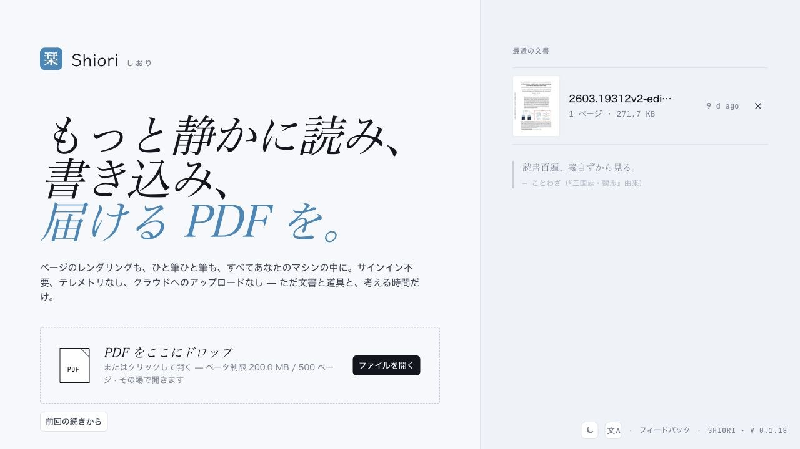

  

<h1 align="center">Shiori 栞</h1>

  PDF、Markdown、HTML のためのローカルファーストな文書リーダー。

  <a href="./README.md">English</a>
  ·
  <a href="./README.zh-CN.md">简体中文</a>
  ·
  <a href="./README.ja.md">日本語</a>

  <a href="https://shiori.nagi.fun">Web サイト</a>
  ·
  <a href="https://github.com/Nagi-ovo/shiori-releases/releases/latest">ダウンロード</a>

Shiori は、文書をクラウドに預けず、静かに読み、書き込み、書き出すための
文書ワークスペースです。中心となるのは PDF 注釈ですが、最近のビルドでは
Markdown と HTML のプレビュー、文書ごとのタブ状態、次回起動時の復元にも対応しています。

## 主な機能

- **PDF の閲覧と注釈**：ハイライト、マークアップ、サムネイル、書き出し、
  ローカル草稿の復元。
- **文書タブ**：PDF、Markdown、HTML を複数開けます。各タブは表示位置や状態を保持し、
  閉じない限り次回起動時にも復元されます。
- **Markdown / HTML プレビュー**：Markdown の front matter を読みやすく表示し、
  HTML は明示的に実行したときだけ隔離サンドボックスで動きます。
- **ローカルファースト**：文書、注釈、最近使ったファイル、設定はあなたの端末に残ります。
- **デスクトップとモバイル**：macOS、Windows、Linux、Android 直接インストール版。
  iOS / iPadOS と Google Play は各ストア経由で配布します。

## スクリーンショット

## ダウンロード

インストーラーは
[GitHub Releases](https://github.com/Nagi-ovo/shiori-releases/releases) で公開しています。

| プラットフォーム | 推奨パッケージ | 更新方法 |
| --- | --- | --- |
| macOS Apple Silicon | `.dmg` | 署名付きアプリ内アップデート |
| macOS Intel | `.dmg` | 署名付きアプリ内アップデート |
| Windows | `.msi` | 署名付きアプリ内アップデート |
| Linux | `.AppImage`；Debian / Ubuntu は `.deb` | `.AppImage` updater または手動更新 |
| Android 直接インストール版 | `.apk` | アプリ内 APK 更新フロー |
| Google Play | 近日公開 | Google Play |
| iOS / iPadOS | 近日公開 | App Store / TestFlight |

デスクトップ版と Android の直接インストール版は、Shiori 内から更新できます。
Android 直接インストール版は APK をアプリ内でダウンロードして検証したあと、
Android のパッケージインストーラーへ渡します。ストア版は各ストアで更新されるため、
このリポジトリには `.aab` や `.ipa` としてミラーしません。

## このリポジトリについて

このリポジトリは Shiori のリリースアーカイブです。インストーラー、更新署名、
ローカライズされたリリースノート、スクリーンショットのみをホストしています。
Shiori のソースリポジトリは非公開で、議論・機能要望・不具合報告はこのリポジトリでは
扱いません。
