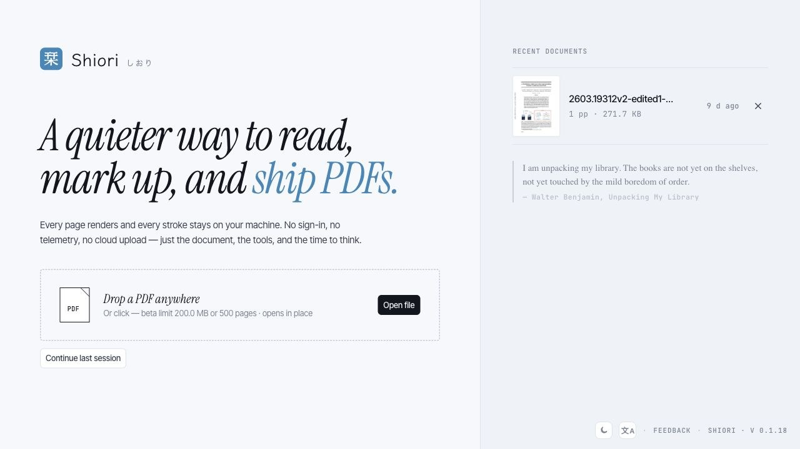

  

<h1 align="center">Shiori 栞</h1>

  A local-first reader for PDF, Markdown, and HTML documents.

  <a href="./README.md">English</a>
  ·
  <a href="./README.zh-CN.md">简体中文</a>
  ·
  <a href="./README.ja.md">日本語</a>

  <a href="https://shiori.nagi.fun">Website</a>
  ·
  <a href="https://github.com/Nagi-ovo/shiori-releases/releases/latest">Downloads</a>

Shiori is a quiet document workspace for reading, marking up, and shipping
documents without turning them into somebody else's cloud data. PDF annotation is
the core workflow, and recent builds also support Markdown and HTML viewing with
tabs, per-document state, and session restore.

## Highlights

- **PDF reading and annotation**: highlights, markup tools, thumbnails, export,
  and local draft recovery.
- **Tabs for documents**: open multiple PDF, Markdown, and HTML files; each tab
  keeps its own view state and survives relaunch until you close it.
- **Markdown and HTML previews**: Markdown front matter is surfaced cleanly, and
  HTML can run in an isolated sandbox only when you choose to run it.
- **Local-first storage**: documents, annotations, recent files, and preferences
  stay on your device.
- **Desktop and mobile targets**: macOS, Windows, Linux, Android direct install,
  with iOS / iPadOS and Google Play distribution handled through their stores.

## Screenshots

## Downloads

Installers are published on the
[GitHub Releases](https://github.com/Nagi-ovo/shiori-releases/releases) page.

| Platform | Recommended package | Update path |
| --- | --- | --- |
| macOS Apple Silicon | `.dmg` | Signed in-app updater |
| macOS Intel | `.dmg` | Signed in-app updater |
| Windows | `.msi` | Signed in-app updater |
| Linux | `.AppImage`; `.deb` for Debian / Ubuntu | `.AppImage` updater or manual package update |
| Android direct install | `.apk` | In-app APK update flow |
| Google Play | Coming soon | Google Play |
| iOS / iPadOS | Coming soon | App Store / TestFlight |

Desktop and Android direct-install builds can update from inside Shiori. Android
direct-install builds download and verify the APK before handing it to the
Android package installer. Store builds are updated by their stores and are not
mirrored here as `.aab` or `.ipa` files.

## About This Repository

This repository is a release archive only. It hosts downloadable builds, updater
signatures, localized release notes, and screenshots. The Shiori source
repository is private, and discussions, feature requests, and bug reports are
handled outside this repo.
