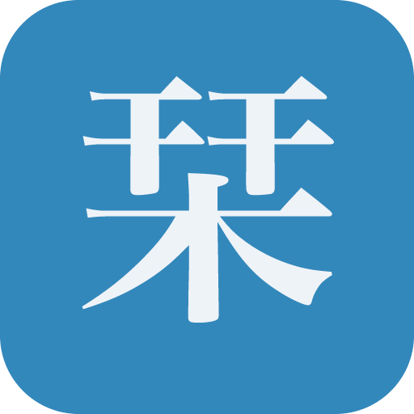

  

<h1 align="center">Shiori 栞</h1>

  A focused document reader and PDF annotation tool for beta testers.

  <a href="https://shiori.nagi.fun">Website</a>
  ·
  <a href="https://github.com/Nagi-ovo/shiori-releases/releases">Releases</a>
  ·
  <a href="https://updates.shiori.nagi.fun/alpha/latest.json">Updater manifest</a>

---

## Downloads

Installers are published on the
[Releases](https://github.com/Nagi-ovo/shiori-releases/releases) page.
The in-app updater reads the signed manifest at
[`alpha/latest.json`](https://updates.shiori.nagi.fun/alpha/latest.json).

| Platform | Recommended package |
| --- | --- |
| macOS Apple Silicon | `aarch64.dmg` |
| macOS Intel | `universal.dmg` |
| Windows | `x64_en-US.msi` |
| Linux | `.AppImage` for portable use, `.deb` for Debian / Ubuntu |
| Android direct install | `.apk` |

iOS / iPadOS is distributed as one universal iPhone + iPad app through the
Apple App Store. Google Play builds are uploaded to Play Console as `.aab`
artifacts and are not mirrored here.

## About This Repository

This repository is a release archive only. It hosts downloadable builds,
updater signatures, localized release notes, and the public update manifest.
Discussions, feature requests, and bug reports are handled outside this repo.

## 中文

这是 Shiori 的版本归档仓库，只用于发布安装包、更新签名、更新说明和
自动更新 manifest，不在这里处理讨论。

下载请前往
[Releases](https://github.com/Nagi-ovo/shiori-releases/releases)；
应用内更新使用
[`alpha/latest.json`](https://updates.shiori.nagi.fun/alpha/latest.json)。

Android 官网直装版使用 `.apk`；Google Play 版使用 Play Console 的 `.aab`，
不会镜像到这里。iOS / iPadOS 使用同一个 App Store 安装包。

## 日本語

このリポジトリは Shiori のリリースアーカイブです。インストーラー、
アップデート署名、リリースノート、公開アップデート manifest のみを
ホストしています。議論や不具合報告はこのリポジトリでは扱いません。

ダウンロードは
[Releases](https://github.com/Nagi-ovo/shiori-releases/releases) から、
アプリ内アップデートは
[`alpha/latest.json`](https://updates.shiori.nagi.fun/alpha/latest.json)
を使用します。

Android の直接インストール版は `.apk` です。Google Play 版の `.aab` は
Play Console 用で、このリポジトリにはミラーしません。iOS / iPadOS は
同じ App Store ビルドを使用します。
