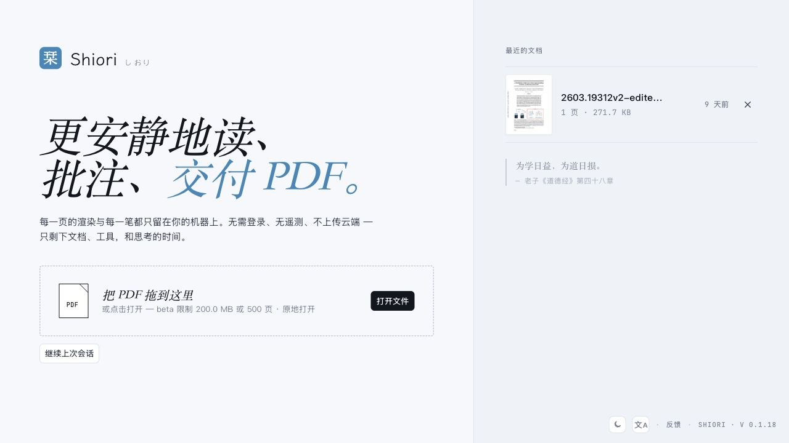
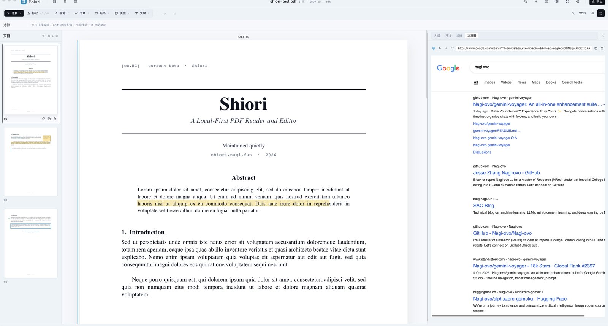
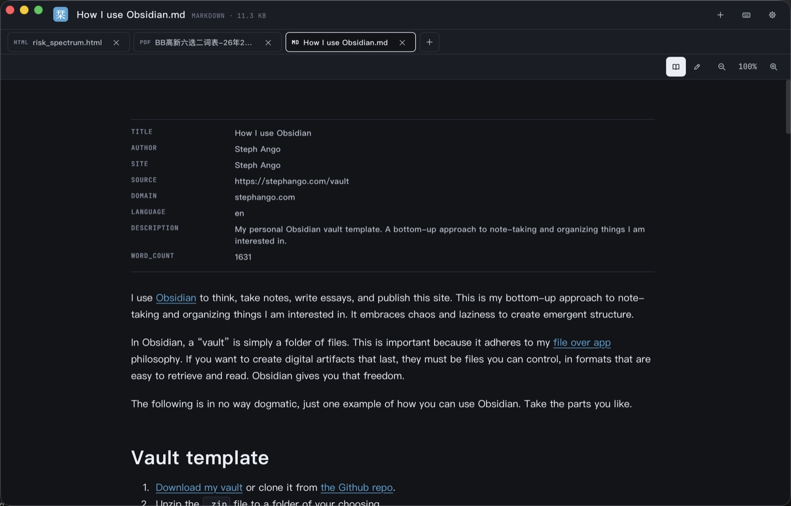
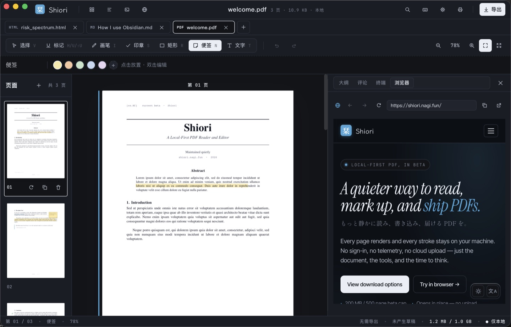
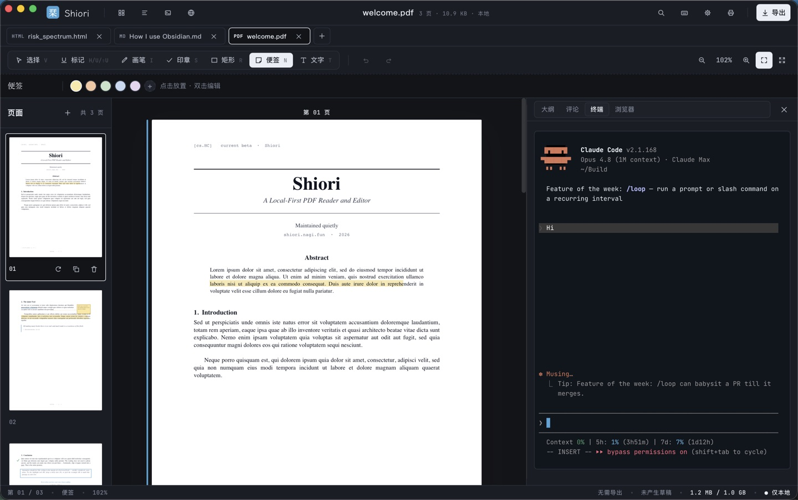
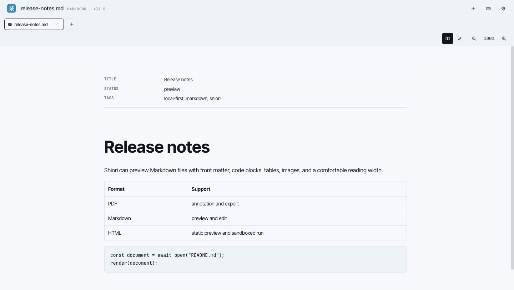
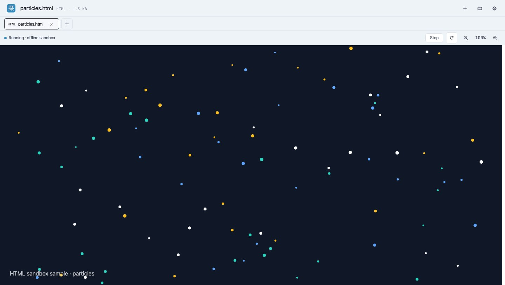

<p align="center">
  
</p>

<h1 align="center">Shiori 栞</h1>

<p align="center">
  本地优先的 PDF、Markdown 与 HTML 文档阅读工具。
</p>

<p align="center">
  <a href="./README.md">English</a>
  ·
  <a href="./README.zh-CN.md">简体中文</a>
  ·
  <a href="./README.ja.md">日本語</a>
</p>

<p align="center">
  <a href="https://shiori.nagi.fun">官网</a>
  ·
  <a href="https://github.com/Nagi-ovo/shiori-releases/releases/latest">下载</a>
</p>



Shiori 是一个安静的文档工作区：阅读、批注、整理、导出，都尽量留在本机。
PDF 批注是核心工作流；现在也支持 Markdown 与 HTML 预览、多标签页、每个文档
独立状态，以及关闭前的工作区恢复。

## 功能亮点

- **PDF 阅读与批注**：高亮、标记工具、缩略图、导出、本地草稿恢复。
- **多文档 Tab**：可以同时打开 PDF、Markdown、HTML；每个 Tab 保留自己的视图状态，
  下次启动会恢复，除非你手动关闭它。
- **Markdown 与 HTML 预览**：Markdown front matter 会清晰展示；HTML 只有在你选择运行时，
  才会进入隔离沙盒执行。
- **桌面侧边工具**：PDF 旁边可以直接打开内置浏览器或终端；如果本机装了 `cc` /
  Claude Code，也可以在 Shiori 的内置终端里启动。
- **本地优先**：文档、批注、最近文件与偏好设置都保留在你的设备上。
- **桌面与移动端目标**：macOS、Windows、Linux、Android 直装版；iOS / iPadOS 与
  Google Play 通过对应商店分发。

## 截图













## 下载

安装包发布在
[GitHub Releases](https://github.com/Nagi-ovo/shiori-releases/releases) 页面。

| 平台 | 推荐安装包 | 更新方式 |
| --- | --- | --- |
| macOS Apple Silicon | `.dmg` | 已签名的应用内更新 |
| macOS Intel | `.dmg` | 已签名的应用内更新 |
| Windows | `.msi` | 已签名的应用内更新 |
| Linux | `.AppImage`；Debian / Ubuntu 可用 `.deb` | `.AppImage` 更新或手动更新 |
| Android 直装版 | `.apk` | 应用内 APK 更新流程 |
| Google Play | 敬请期待 | Google Play |
| iOS / iPadOS | 敬请期待 | App Store / TestFlight |

桌面端和 Android 直装版都可以在 Shiori 内更新。Android 直装版会在应用内下载并
校验 APK，然后交给 Android 系统安装器。商店版由对应商店更新，不会在这里镜像
`.aab` 或 `.ipa`。

## Agent skill

开源的 [Shiori CLI skill](./skills/shiori) 会告诉 Codex、Claude Code 等兼容的
coding agent，如何读取 Shiori 当前打开的文档、按文本定位原文、添加锚定批注，
以及在引线批注中继续回复。使用前需要确保 `shiori` CLI 已在 `PATH` 中。

克隆本仓库后，macOS 和 Linux 用户可以把 skill 链接到对应 Agent 的用户级目录：

```sh
ln -s "$(pwd)/skills/shiori" "${CODEX_HOME:-$HOME/.codex}/skills/shiori"
ln -s "$(pwd)/skills/shiori" "$HOME/.claude/skills/shiori"
```

只需执行与你使用的 Agent 对应的那一行。skill 单独采用
[MIT License](./skills/shiori/LICENSE)；该许可证不适用于 Shiori 应用或 CLI 二进制文件。

## 关于这个仓库

这个仓库托管安装包、更新签名、本地化 release notes、截图，以及开源的 Shiori CLI
Agent skill。Shiori 应用源码仓库是私有仓库；讨论、功能请求和 bug 反馈不在这里处理。
