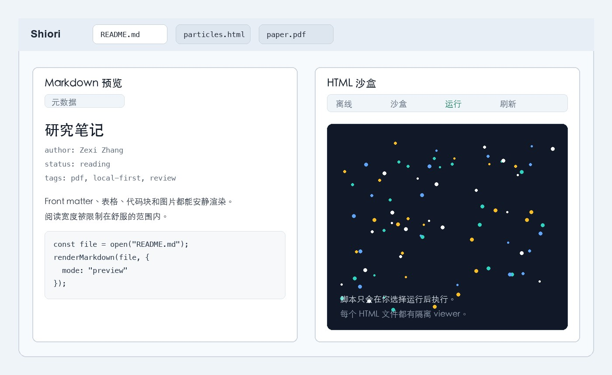

  

<h1 align="center">Shiori 栞</h1>

  本地优先的 PDF、Markdown 与 HTML 文档阅读工具。

  <a href="./README.md">English</a>
  ·
  <a href="./README.zh-CN.md">简体中文</a>
  ·
  <a href="./README.ja.md">日本語</a>

  <a href="https://shiori.nagi.fun">官网</a>
  ·
  <a href="https://github.com/Nagi-ovo/shiori-releases/releases/latest">最新版本</a>
  ·
  <a href="https://updates.shiori.nagi.fun/alpha/latest.json">更新 manifest</a>

Shiori 是一个安静的文档工作区：阅读、批注、整理、导出，都尽量留在本机。
PDF 批注是核心工作流；现在也支持 Markdown 与 HTML 预览、多标签页、每个文档
独立状态，以及关闭前的工作区恢复。

## 功能亮点

- **PDF 阅读与批注**：高亮、标记工具、缩略图、导出、本地草稿恢复。
- **多文档 Tab**：可以同时打开 PDF、Markdown、HTML；每个 Tab 保留自己的视图状态，
  下次启动会恢复，除非你手动关闭它。
- **Markdown 与 HTML 预览**：Markdown front matter 会清晰展示；HTML 只有在你选择运行时，
  才会进入隔离沙盒执行。
- **本地优先**：文档、批注、最近文件与偏好设置都保留在你的设备上。
- **桌面与移动端目标**：macOS、Windows、Linux、Android 直装版；iOS / iPadOS 与
  Google Play 通过对应商店分发。

## 截图

## 下载

安装包发布在
[GitHub Releases](https://github.com/Nagi-ovo/shiori-releases/releases) 页面。

| 平台 | 推荐安装包 | 更新方式 |
| --- | --- | --- |
| macOS Apple Silicon | `.dmg` | 已签名的应用内更新 |
| macOS Intel | `.dmg` | 已签名的应用内更新 |
| Windows | `.msi` | 已签名的应用内更新 |
| Linux | `.AppImage`；Debian / Ubuntu 可用 `.deb` | `.AppImage` 更新或手动更新 |
| Android 直装版 | `.apk` | 应用内 APK 更新流程 |
| Google Play | 敬请期待 | Google Play |
| iOS / iPadOS | 敬请期待 | App Store / TestFlight |

桌面端自动更新读取已签名的
[`alpha/latest.json`](https://updates.shiori.nagi.fun/alpha/latest.json)。
Android 直装版会在应用内下载并校验 APK，然后交给 Android 系统安装器。商店版由
对应商店更新，不会在这里镜像 `.aab` 或 `.ipa`。

## 关于这个仓库

这个仓库只作为发布归档使用：托管安装包、更新签名、本地化 release notes、截图和
公开更新 manifest。Shiori 源码仓库是私有仓库；讨论、功能请求和 bug 反馈不在这里处理。
